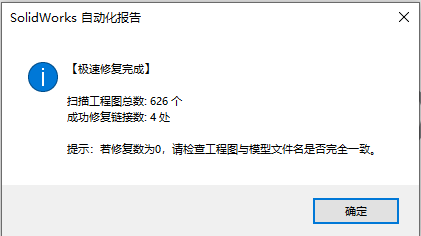

# SolidWorks 工程图引用极速修复宏 (Fast Reference Repair)

> **解决问题：批量修复solidworks文件，更改名称后工程图与3d图纸的链接断裂。。
>
> 如需批量填写自定义属性，请见 [sw-property-updater-batch](https://github.com/mdmodule/sw-property-updater-batch)。



## 核心定位：选择文件夹 · 递归扫描 · 同名匹配 → 索引重定向

传统"参考"对话框修复引用需要逐个打开工程图、手动浏览模型路径——文件一多就崩溃。**本宏完全不加载图形界面**，用 `GetDocumentDependencies2` 读取依赖、`ReplaceReferencedDocument` 直接改写文件头索引。

```
选择工程文件夹/
├── 脚轮+MDM-005+V1.0.slddrw    → 依赖指向旧路径 ✗
├── 脚轮+MDM-005+V1.0.sldprt    ← 同名模型就在同目录 ✓
├── 支架+MDM-006+V1.0.slddrw    → 依赖指向旧路径 ✗
├── 支架+MDM-006+V1.0.sldprt    ← 同名模型就在同目录 ✓
└── 子装配/
    ├── 底板+MDM-007+V1.0.slddrw → 递归处理 ✓
    └── 底板+MDM-007+V1.0.sldprt

         ↓ 极速修复
┌─────────────────────────────────────┐
│  【极速修复完成】                   │
│  扫描工程图总数: 3 个               │
│  成功修复链接数: 3 处               │
└─────────────────────────────────────┘
```

## 为什么是"极速"？

| 对比 | 传统方法 | 本宏 |
|------|---------|------|
| 打开方式 | 逐个打开工程图，加载图形 | 不打开文件，只读文件头 |
| 修改方式 | 手动浏览 → 替换模型路径 | 同名匹配 → 自动重定向 |
| 速度 | 大装配体打开需要数十秒 | 毫秒级处理 |
| 内存 | 显存+内存双高 | 几乎不占额外内存 |
| 子文件夹 | 手动逐层进入 | 自动递归全遍历 |

## 功能特性

- **极速处理**：不加载模型图形界面，仅操作文件头索引，速度远超传统打开方式
- **递归扫描**：自动遍历选定文件夹及其所有子文件夹中的 `.slddrw` 工程图
- **同名智能匹配**：工程图与模型文件名一致时（如 `底板.slddrw` ↔ `底板.sldprt`），自动识别并重定向
- **双格式支持**：同时查找 `.sldprt`（零件）和 `.sldasm`（装配体）两种模型格式
- **统计报告**：处理完成后弹窗汇总扫描总数和修复成功的链接数
- **零配置运行**：选择一个文件夹即可，无需预定义任何路径映射

## 适用场景

- 零件/装配体重命名后，工程图引用断裂
- 项目文件夹整体迁移（换电脑、换盘符）
- 从旧版本升级后引用路径变化
- 批量整理文件结构后需要重新关联

> [!] **前提条件**：工程图与模型文件**必须在同一文件夹内**，且**文件名（不含扩展名）必须完全一致**。

## 文件命名规范

```
零件名称+图样代号+版本号.sldprt
零件名称+图样代号+版本号.slddrw
```

- [OK] `底板+MDM-001+V1.0.slddrw` + `底板+MDM-001+V1.0.sldprt`（同目录）→ 自动修复
- [!] `底板+MDM-001+V1.0.slddrw` 但模型在别的文件夹 → 无法修复，需手动处理

## 使用方法

1. 打开 SolidWorks（无需打开任何文件）
2. `工具` → `宏` → `运行`，选择 `FastRefFix.swp`
3. 在弹出的文件夹选择对话框中，选择工程图所在的根目录
4. 等待处理完成，查看统计弹窗

> [!] **注意**：若修复数为 0，请检查工程图与模型文件名（不含扩展名）是否完全一致，且是否在同一文件夹内。

## 环境要求

- SolidWorks 2025（理论上兼容 SolidWorks 2018+）
- 启用宏的 SolidWorks 环境

## 安装

1. 下载 `FastRefFix.bas`
2. 在 SolidWorks 中：`工具` → `宏` → `新建` → 粘贴代码 → 保存为 `.swp`
3. 可选：添加到 SolidWorks 自定义工具栏，绑定快捷键

## 许可

MIT License - 随意使用和修改。

## 作者

机械工程师，借助 AI 辅助开发。
